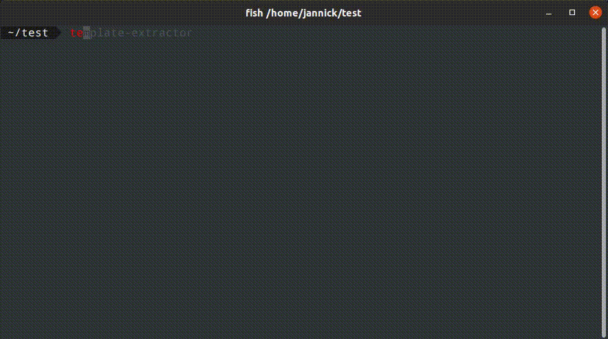

<div align="center">
  <h1>
    <br>
    
    <br>
    Template Extractor
    <br>
  </h1>

  <h4>Dynamic boilerplates enclosed in Archives</h4>

  <p>
    <a href="#overview">Overview</a> •
    <a href="#archive-structure">Archive Structure</a> •
    <a href="#usage">Usage</a> •
    <a href="#creating-an-archive">Creating an Archive</a> •
    <a href="#enhanced-javascript-support">Enhanced JavaScript Support</a> •
    <a href="#installation">Installation</a>
  </p>

  
</div>

## Overview

This program allows users to integrate boilerplate files from a selected archive into a main installation. Each archive is a `.zip` file that contains a set of predefined and custom files. These files work together to define the structure and behavior of the archive during the integration process.

## Archive Structure

Every archive is structured with a set of mandatory and optional files:

### Mandatory Files:

- **`.env`**:
  - Contains variables that are accessible by the `build.sh` script and any other files in the archive.
  - Variables are defined in the format `KEY=VALUE`. 
  - If a value is left empty in the `.env` file (e.g., `KEY=`), the program will prompt the user to provide it during runtime.
  - Additionally, you can define a function call, e.g., `KEY=generate_key_values()`, which the program will attempt to execute using the `env_resolver.sh` script.

- **`build.sh`**:
  - A shell script that is executed when the archive is selected.
  - Responsible for integrating the files from the archive into the main installation.
  - Can access and use variables defined in the `.env` file.

### Optional Files:

- **env_resolver.sh**:
  - Contains bash functions that can be referenced in the `.env` file.
  - When the `.env` file references a function, this script is sourced, and the function is executed.
  - The return of the function is then used to provide a set of options or a prompt to the user.

- **README.md**:
  - Contains a brief description of what the archive is for.
  - When a user selects an archive, the contents of the `README.md` file are displayed in a formatted view to provide context about the archive.

- **[Any Other Files or Directories]**:
  - These are the boilerplate files or directories that the `build.sh` script may modify or copy over during the integration process.

## Usage

1. Run the program.
2. If running for the first time, specify the directory where the `.zip` archives are stored. This directory can be anywhere on your system.
3. A list of available archives in the specified directory will be displayed. Navigate and select one.
4. The README (if available) of the chosen archive will be displayed. You'll then be asked whether you want to proceed with this archive.
5. If the `.env` file in the archive has empty values or function calls, you'll be prompted to provide or select them.
6. The `build.sh` script from the archive will be executed, performing the integration process.
7. Once the process is completed, you'll be notified of the success or failure of the operation.

## Creating an Archive

To create an archive:

1. Organize your files (including the mandatory `.env` and `build.sh`) in a directory.
2. Optionally, add an `env_resolver.sh` if you have function calls in your `.env` file.
3. Optionally, add a `README.md` for a description and any other boilerplate files or directories you wish to include.
4. Compress the directory into a `.zip` file.
5. Place the `.zip` file into the archives directory (or any directory you intend to specify when running the program).

## Enhanced JavaScript Support

### Using `build.js` and `env_resolver.js`

Starting from v1.0.0, we've introduced support for `build.js` and `env_resolver.js` files to provide more flexibility in defining build processes and environment variable resolvers.

#### `build.js`
Instead of the traditional `build.sh`, you can now use `build.js` to define your build process. This allows for more complex logic, asynchronous operations, and easier integrations with other JavaScript tools or libraries.

To utilize this, simply include a `build.js` in your archive. The script will automatically be executed during the build process.

#### `env_resolver.js`
For dynamic resolution of environment variables defined in `.env` with a function call, you can now use a `env_resolver.js` file. This file should export functions that return values based on your logic. 

For example, if your `.env` file has:

```
module_name=resolveModuleName()
```

Your `env_resolver.js` should export a function `resolveModuleName` that returns the desired value.

### Helper Functions

To aid in the creation of `build.js` scripts, we've provided a set of utility functions in `helper.js`. You can easily integrate these into your build process for common tasks.

Here's a brief overview:

- `copyFile(src, dest)`: Copies a file from src to dest.
- `createDir(path, options)`: Creates a directory. Can be recursive.
- `createFile(path)`: Creates an empty file.
- `searchAndReplaceFileContentsRegex(path, regex, replaceString)`: Replaces content in a file based on a regex pattern.
- `appendStringToFile(path, string)`: Appends a string to a file.
- `prependStringToFile(path, string)`: Prepends a string to the beginning of a file.
- `searchAndReplaceFileContents(path, matchString, replaceString)`: Searches and replaces a substring in a file.

[... and some more] - look at the `types.d.ts` for more detailed information.

To use these functions in your `build.js`, simply require them:
`const { copyFile, createDir } = require('./helper.js')`;

These utilities are designed to streamline the build process and make it easier for developers to create complex build scripts without having to reimplement common operations.

## Installation

### Recommended

Install the necessary packages, using pip:

```bash
$ pip install PyInquirer pathlib rich pyinstaller
```

Convert the program into a binary, using **pyinstaller**:

```bash
$ pyinstaller --onefile main.py
```

Now you should find the binary under `dist/main`.

Copy the binary to `/usr/bin` and rename it as you like:

```bash
$ cp dist/main /usr/bin/template-extractor
```

Now you should be able to use the program, everywhere on your machine. Just do:

```bash
$ template-extractor
```

You should be prompted to define a directory for the archives.

### Quick Start

Download the `dist/main` file and move it to `/usr/bin/template-extractor`.

```bash
$ mv dist/main /usr/bin/template-extractor
```

Now you should be able to use the program, everywhere on your machine. Just do:

```bash
$ template-extractor
```

You should be prompted to define a directory for the archives.